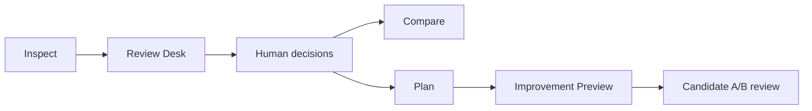

# Dataset Forge

**A local, evidence-first workstation for curating LoRA and image datasets.**

Dataset Forge helps you inspect a dataset, understand why images need
attention, record human decisions, compare inspection runs, and review
disposable preview candidates. It is deterministic, advisory, and designed to
leave source datasets untouched.

Current release: **v1.9.3 -- Review Desk UX Polish**

## Why Dataset Forge

Dataset preparation is usually reduced to deletion, scoring, or one-click
processing. Dataset Forge takes a different approach:

- findings show measurable evidence and plain-language context;
- the browser Review Desk keeps decisions centered on images;
- raw analyzer and category IDs remain available for traceability;
- Dataset Intelligence describes the dataset without grading it;
- inspection manifests make runs reproducible and comparisons honest;
- source images are never modified, moved, renamed, deleted, or exported.

Findings are review signals, not automatic defects. `No Findings Emitted` means
only that current analyzers emitted no finding. It is not a training-readiness
claim.

## The Workflow



No step applies a candidate to the source dataset.

## Quick Start

```powershell
git clone https://github.com/surrealbydesign/dataset-forge.git
cd dataset-forge
uv sync

uv run dataset-forge inspect "C:\path\to\my_dataset"
uv run dataset-forge review "C:\path\to\my_dataset\inspect_output"
```

`inspect` prints a **Start Here** block with the exact Review Desk command and
the reports worth opening first. Review decisions and notes save locally to
`review_decisions.json`.

[Read the Getting Started guide](docs/getting-started.md)

## Review Desk

The localhost Review Desk is the primary interface. It provides:

- Priority Review, Needs Review, and No Findings Emitted queues;
- thumbnails, detailed evidence, severity, confidence, and advisory wording;
- filters, keyboard navigation, zoom, pan, and selected-image detail;
- Keep, Accepted Style, Improvement Candidate, Exclude Candidate, and Undecided decisions;
- workflow state and notes with visible save feedback;
- descriptive Dataset Intelligence without scores or grades;
- original/candidate A/B review when preview artifacts exist.

**Set Aside Intent (no files moved)** records workflow intent only. Dataset
Forge does not create quarantine folders or move files.

[Read the Review Desk guide](docs/review-desk-guide.md)

## Deterministic Analyzers

Dataset Forge currently includes advisory analyzers for:

- high microtexture;
- crystal-like surface patterns;
- oversharpening and edge halos;
- isolated high-frequency specks;
- exact and decoded-pixel duplicates;
- conservative perceptual near-duplicates;
- JPEG and source-encoding context;
- adjacent caption-sidecar consistency.

Known false-positive contexts include JPEG ringing, natural grain, watercolor
or pencil texture, engraving, hard-edge line art, and intentional glitter or
highlights. Analyzer confidence is advisory and does not represent certainty.

## Improvement Preview

`dataset-forge preview` writes planning metadata only. A preview record can
describe an operation, rationale, evidence, required provider, status, and
approval state.

Two candidate paths exist:

- `preview-import` copies an externally created candidate into an isolated
  inspect-output workspace.
- `preview-generate` creates a deterministic LOCAL_CLASSICAL candidate for a
  compatible `REDUCE_HALO` or `REDUCE_ENCODING_ARTIFACTS` plan.

Candidates are disposable preview artifacts. Approval does not execute,
export, replace, or apply them.

[Read the Improvement Preview guide](docs/improvement-preview-guide.md)

## Public Commands

```text
dataset-forge inspect
dataset-forge review
dataset-forge compare
dataset-forge plan
dataset-forge preview
dataset-forge preview-import
dataset-forge preview-generate
dataset-forge --help
dataset-forge --version
```

There is no public cleanup, improved-dataset export, source-editing, training,
cloud, profile-selection, analyzer-toggle, or plugin command.

## Safety Boundary

Dataset Forge may write reports, decisions, planning sidecars, and isolated
candidate artifacts inside its output workspace. It does not:

- modify source images or caption sidecars;
- move, rename, delete, quarantine, or export source files;
- apply preview operations to a dataset;
- call Krea, ComfyUI, cloud APIs, or external services;
- launch provider subprocesses;
- use ML, embeddings, CLIP, diffusion, or generative AI.

## Documentation

- [Documentation index](docs/README.md)
- [Getting Started](docs/getting-started.md)
- [User Guide](docs/user-guide.md)
- [Review Desk Guide](docs/review-desk-guide.md)
- [Improvement Preview Guide](docs/improvement-preview-guide.md)
- [Provider Overview](docs/provider-overview.md)
- [JSON Schema Guide](docs/json-schema-guide.md)
- [Developer Guide](docs/developer-guide.md)
- [FAQ](docs/faq.md)
- [Troubleshooting](docs/troubleshooting.md)
- [Terminology](docs/terminology.md)

## Development

```powershell
uv run python -m pytest -q
git diff --check
```

See the [Developer Guide](docs/developer-guide.md),
[Architecture](ARCHITECTURE.md), and [Current Status](CURRENT_STATUS.md) for
implementation boundaries and release state.

## License

See [LICENSE](LICENSE).
