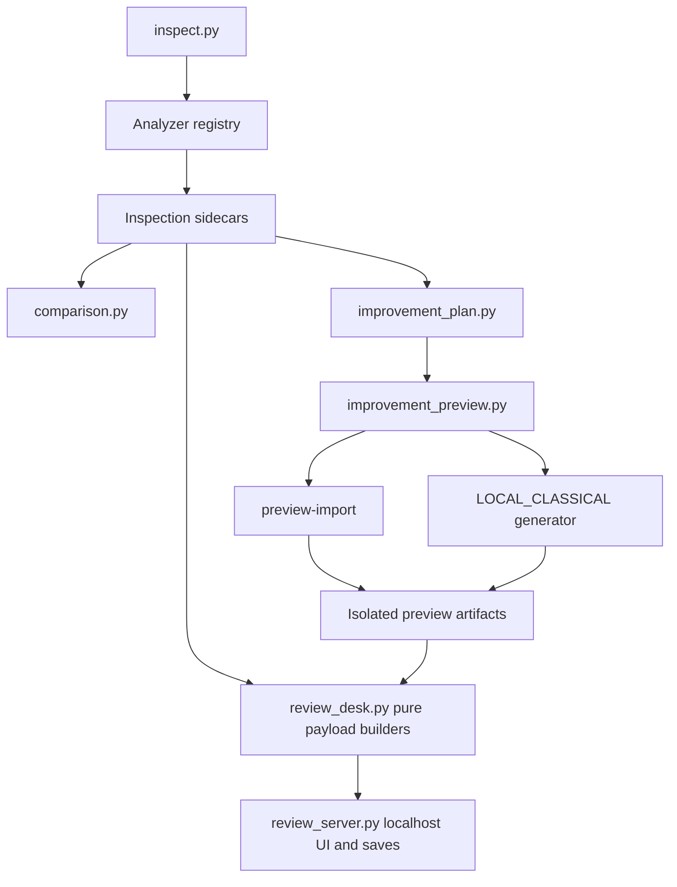

# Developer Guide

## Architecture At A Glance



## Important Boundaries

- Analyzer implementations emit Findings and do not know Review Desk policy.
- `analyzer_descriptors.py` owns analyzer metadata.
- `inspection_profiles.py` owns immutable profile contracts.
- `review_signal_policy.py` resolves effective execution/display/triage policy.
- `inspection_manifest.py` snapshots provenance and effective policy.
- `review_desk.py` contains deterministic sidecar-to-payload logic and writes no files.
- `review_server.py` owns localhost routing and the two browser save paths.
- `preview_artifacts.py` owns isolated artifact validation and persistence.
- `local_classical_preview.py` owns the two implemented image operations.

## Adding Or Changing Code

Preserve these invariants:

1. Source datasets are read-only.
2. Analyzer output is deterministic and explainable.
3. Existing schemas evolve additively.
4. Review Desk consumes sidecars and does not run analyzers.
5. Candidate artifacts remain isolated and disposable.
6. Provider descriptors do not become hidden execution hooks.

## Tests

Run focused tests while editing, then the complete suite:

```powershell
uv run python -m pytest -q
git diff --check
```

High-risk paths need explicit tests for source hashes, path containment,
transaction rollback, malformed sidecars, deterministic ordering, and legacy
compatibility.

## Public CLI

The supported command set is defined in `cli.py` and documented in the
[User Guide](user-guide.md). Dormant legacy packages under cleanup, execution,
exporter, transform, and plugin namespaces are not public v1.9.3 capabilities.

## Documentation

Update the README, Current Status, Changelog, CLI Output Specification, and the
relevant guide whenever user-visible wording changes. Machine IDs should remain
visible as secondary reference when friendly labels are introduced.
