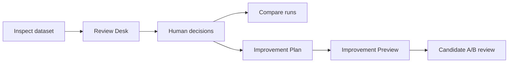

# User Guide

## Workflow



Every arrow is sidecar-driven. No step applies a candidate to the source
dataset.

## Inspect

```powershell
uv run dataset-forge inspect <dataset> [--output <directory>] [--recursive]
```

Optional visual artifacts:

```powershell
uv run dataset-forge inspect <dataset> --review-gallery --contact-sheets
```

Primary outputs include the inspection report, recommendation summary, triage
dossiers, inspection manifest, and review-decision template.

## Review

```powershell
uv run dataset-forge review <inspect_output> [--port 8765]
```

The Review Desk is the primary interface. It consumes sidecars and serves
allow-listed source images and candidate artifacts on `127.0.0.1` only.

Human decisions:

- **Keep** (`KEEP`)
- **Accepted Style / False Positive** (`ACCEPTED_STYLE_FALSE_POSITIVE`)
- **Improvement Candidate** (`IMPROVEMENT_CANDIDATE`)
- **Exclude Candidate** (`REMOVAL_CANDIDATE`)
- **Undecided** (`UNDECIDED`)

Workflow states are separate from decisions:

- **In Dataset** (`IN_DATASET`)
- **Set Aside Intent (no files moved)** (`QUARANTINE_PLANNED`)
- **Review Complete** (`REVIEWED`)

A recorded decision contributes to decision progress. **Review Complete** is a
separate workflow stage, so the two counts may differ.

The raw values remain stable for sidecar compatibility; the friendly labels
are the preferred user-facing terms.

## Compare

```powershell
uv run dataset-forge compare <before_output> <after_output> --output <directory>
```

Comparison reads existing sidecars. When manifests are present, it reports
provenance compatibility. Warnings are advisory and do not block comparison.

## Plan

```powershell
uv run dataset-forge plan <inspect_output> [--output <directory>]
```

The Improvement Plan is advisory. It documents evidence-backed possible next
steps and never executes them.

## Preview

```powershell
uv run dataset-forge preview <inspect_output>
```

This writes `improvement_preview.json` and `improvement_preview.md`. The plan
contains one deterministic operation per image. When several finding families
exist, fixed precedence selects one operation; review all attached evidence
rather than treating that operation as a complete diagnosis.

## Candidate Previews

Import an externally created candidate:

```powershell
uv run dataset-forge preview-import <inspect_output> <source-image> <candidate-image>
```

Generate a compatible LOCAL_CLASSICAL candidate:

```powershell
uv run dataset-forge preview-generate <inspect_output> <source-image>
```

Use `--replace` only when intentionally replacing the candidate associated
with that preview plan. Candidates remain isolated in `preview_artifacts/`.

## Safety Summary

Dataset Forge does not clean datasets, export improved datasets, apply preview
candidates, call cloud providers, invoke training, or modify source images or
caption sidecars.
